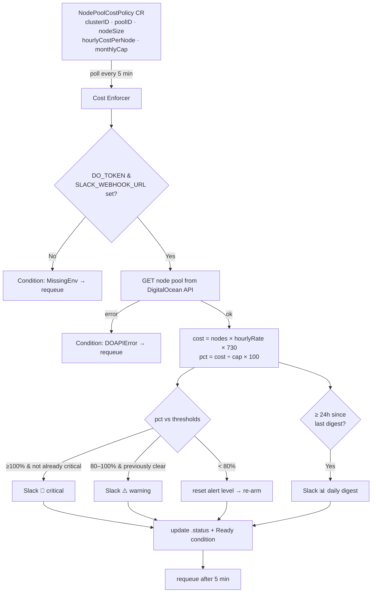

<div align="center">

# 💸 DOKS Cost Enforcer Operator

**Declarative cost guardrails for DigitalOcean Kubernetes node pools. Set a monthly budget as a Kubernetes resource, and get Slack alerts *before* the invoice surprises you.**

[](https://go.dev)
[](https://kubernetes.io)
[](https://www.digitalocean.com/products/kubernetes)
[](https://api.slack.com/messaging/webhooks)
[](https://www.apache.org/licenses/LICENSE-2.0)
[](https://book.kubebuilder.io)

</div>

---

## The problem in one breath

Kubernetes spend is invisible right up until the invoice lands. A node pool quietly scales up under load, stays up, and the first time anyone notices is on the first of the month when finance asks why the DigitalOcean bill doubled.

**The DOKS Cost Enforcer Operator makes that spend visible — as code, in your cluster, in real time.**

You declare a budget for a node pool as a Kubernetes resource. The operator polls DigitalOcean every five minutes, projects the pool's monthly run-rate, and posts to Slack the moment you cross 80% (warning) or 100% (cap reached) of that budget — plus a daily digest so the number is never a mystery. Everything also shows up in `kubectl get nodepoolcostpolicies`.

Think of it as **a smoke detector for your node-pool bill.**

---

## Features

- 📜 **Budgets as code** — a `NodePoolCostPolicy` CRD lives next to your manifests, version-controlled and reviewable in PRs.
- 📈 **Live run-rate projection** — `nodeCount × hourlyCostPerNode × 730` recomputed every poll, surfaced in status and `kubectl`.
- 🔔 **Tiered Slack alerts** — a ⚠️ warning at ≥80% and a 🚨 critical at ≥100% of the cap.
- 📊 **Daily digest** — a once-a-day cost summary to Slack regardless of thresholds, so the number stays top of mind.
- 🤫 **No alert spam** — a small state machine only fires on threshold *transitions*, then re-arms when cost recovers.
- 👀 **kubectl-native** — printer columns show Cap, Est. Cost, % of Cap and Alert level at a glance.
- 🔒 **Hardened by default** — runs non-root with a read-only root filesystem and all Linux capabilities dropped.
- 🪶 **Featherweight** — `10m` CPU / `64Mi` memory requested. It mostly sleeps.
- 🔑 **Secrets stay secret** — DO token and Slack webhook are injected from Kubernetes Secrets; a `kubeseal` script ships for GitOps-safe SealedSecrets.

---

## How it works



Every five minutes, for each policy, the operator:

1. **Loads credentials** — `DO_TOKEN` and `SLACK_WEBHOOK_URL` from the environment (injected from Secrets). If either is missing it records a `MissingEnv` condition and tries again later instead of crash-looping.
2. **Polls DigitalOcean** — fetches the node pool by `clusterID` + `poolID`. On API failure it records `DOAPIError` and requeues.
3. **Projects the cost** — `currentMonthlyCost = nodeCount × hourlyCostPerNode × 730` (730 ≈ hours in an average month), and `percentOfCap = cost / monthlyCap × 100`.
4. **Decides on alerts** — see the state machine below.
5. **Sends the daily digest** — if it's been ≥24h since the last one.
6. **Writes status** — node count, projected cost, % of cap, alert level, timestamps, and a `Ready` condition with a human summary like `est. $584.00 (83.4% of cap)`.

### The alert state machine (why it doesn't spam you)

`lastAlertLevel` remembers what was last announced — `""` (clear), `warning`, or `critical`:

| Current cost | Last level | Action |
|---|---|---|
| ≥ 100% | not `critical` | send 🚨 **critical**, set level → `critical` |
| 80–100% | `""` (clear) | send ⚠️ **warning**, set level → `warning` |
| < 80% | any | reset level → `""` (re-arms both alerts) |

The upshot: each threshold announces itself **once** when you cross into it, not on every poll. Dropping from critical back into the warning band stays quiet (no "downgrade" noise), and once cost falls below 80% the alarms re-arm for the next climb. The daily digest is independent and always sends every 24h.

---

## Quick start

### Prerequisites

- A running **DOKS** cluster
- A **DigitalOcean API token** with read access to Kubernetes
- A **Slack incoming webhook** URL
- `kubectl` pointed at the cluster, plus `Go 1.22+`, `Docker`, and `make` to build
- *(optional, for GitOps)* the [sealed-secrets](https://github.com/bitnami-labs/sealed-secrets) controller + `kubeseal`

### 1. Build & push the image

```bash
make docker-build docker-push IMG=<your-registry>/doks-cost-enforcer:0.1.0
```

### 2. Install the CRD

```bash
make install
```

### 3. Create the namespace and secrets

```bash
kubectl create namespace doks-cost-enforcer-system

# DigitalOcean token — key MUST be 'token'
kubectl create secret generic do-token \
  --namespace doks-cost-enforcer-system \
  --from-literal=token="<YOUR_DO_API_TOKEN>"

# Slack webhook — key MUST be 'url'
kubectl create secret generic slack-webhook \
  --namespace doks-cost-enforcer-system \
  --from-literal=url="https://hooks.slack.com/services/XXX/YYY/ZZZ"
```

> 💡 **GitOps tip:** prefer not to hand a plaintext token to `kubectl`? Run the bundled `hack/seal.sh` to produce committable SealedSecrets with `kubeseal`. Point `--controller-namespace` at wherever your sealed-secrets controller runs (commonly `kube-system`).

### 4. Deploy the controller

```bash
make deploy IMG=<your-registry>/doks-cost-enforcer:0.1.0
```

### 5. Declare a budget

```yaml
# config/samples/nodepoolcostpolicy.yaml
apiVersion: platform.mahy.love/v1alpha1
kind: NodePoolCostPolicy
metadata:
  name: chat-pool-cost
spec:
  clusterID: "your-cluster-uuid"
  poolID: "your-pool-uuid"
  nodeSize: "s-8vcpu-16gb"       # label only — shown in Slack for context
  hourlyCostPerNode: 0.20        # USD/hr — look up the live rate for your size
  monthlyCap: 700                # USD/mo budget
```

```bash
kubectl apply -f config/samples/nodepoolcostpolicy.yaml
```

### 6. Watch it

```bash
kubectl get nodepoolcostpolicies
```

```text
NAME               POOL                CAP ($)   EST. COST ($)   % OF CAP   ALERT     AGE
chat-pool-cost   a1b2c3d4-...-pool   700       584.00          83.4       warning   2d
```

…and the matching message lands in your Slack channel.

---

## Configuration reference

`spec` fields of a `NodePoolCostPolicy` (all **required**):

| Field | Type | Description |
|---|---|---|
| `clusterID` | string | DigitalOcean Kubernetes cluster UUID. |
| `poolID` | string | DigitalOcean node pool UUID to monitor. |
| `nodeSize` | string | Human-readable size label (e.g. `s-8vcpu-16gb`). Used only for context in Slack messages. |
| `hourlyCostPerNode` | number | USD/hour for a single node of this size. **You set this** — see the caveat below. |
| `monthlyCap` | number | Monthly budget in USD. Warning fires at 80%, critical at 100%. |

### Status & alerts

| Status field | Meaning |
|---|---|
| `currentNodeCount` | Nodes reported by DO on the last poll. |
| `currentMonthlyCost` | `nodeCount × hourlyCostPerNode × 730`, rounded to cents. |
| `percentOfCap` | `currentMonthlyCost ÷ monthlyCap × 100`. |
| `lastAlertLevel` | `""` (none) · `warning` (≥80%) · `critical` (≥100%). |
| `lastAlertSentAt` / `lastDigestSentAt` / `lastPollTime` | Timestamps for the last alert, digest, and successful poll. |
| `conditions[Ready]` | Overall health + a human summary string. |

| Slack message | When it fires | Colour |
|---|---|---|
| ⚠️ **Warning** | crossing into 80–100% of cap from a clear state | orange |
| 🚨 **Critical** | crossing into ≥100% of cap | red |
| 📊 **Daily digest** | every 24h, regardless of threshold | green / orange / red by level |

Wait on a policy in scripts via the standard condition:

```bash
kubectl wait nodepoolcostpolicy/chat-pool-cost \
  --for=condition=Ready --timeout=120s
```

---

## Local development

```bash
export DO_TOKEN="<YOUR_DO_API_TOKEN>"
export SLACK_WEBHOOK_URL="https://hooks.slack.com/services/XXX/YYY/ZZZ"
make install   # CRD into the cluster
make run        # run the manager locally against your kubeconfig
```

Other targets:

```bash
make manifests  # regenerate CRD + RBAC from kubebuilder markers
make generate   # regenerate deepcopy code
make test       # unit tests
make build      # compile to ./bin
```

---

## Project layout

```text
doks-cost-enforcer-operator/
├── api/v1alpha1/           # CRD types (NodePoolCostPolicySpec/Status)
├── internal/
│   ├── controller/         # reconcile loop + thresholds/constants
│   ├── do/                 # thin godo wrapper: GetNodePool
│   └── slack/              # webhook payload builders + senders
├── config/                 # kustomize bases (CRD, RBAC, manager, samples)
│   └── deploy/             # generated SealedSecrets land here
├── hack/seal.sh            # kubeseal helper for do-token + slack-webhook
├── Dockerfile
└── Makefile
```

---

## Caveats & honest limitations

- **It's an estimate, not your invoice.** The projection covers node-pool compute only. It does **not** include load balancers, block storage / snapshots, bandwidth, container registry, or HA control-plane fees. Treat it as a run-rate signal, not an accounting figure.
- **`hourlyCostPerNode` is hand-entered.** The operator doesn't fetch live pricing — if DigitalOcean changes rates or you resize the pool, update the policy. Keeping it accurate is on you.
- **It alerts; it doesn't (yet) enforce.** Despite the name, today it warns — it won't cap, cordon, or scale a pool down on its own. Automated enforcement is a natural next step, not a current feature.
- **Linear run-rate.** Cost = *current* node count projected across a full month (×730h). A temporary spike inflates the projection; a quiet stretch deflates it. That's intentional for "where are we trending right now," but it's not a month-end forecast.
- **One pool per policy.** Create a `NodePoolCostPolicy` per pool you want watched.

---

## Companion project

Pairs naturally with the **[DOKS Capacity Operator](https://github.com/tabed23/doks-capacity-operator)** — that one *raises* a pool's autoscale ceiling as demand grows; this one *watches the bill* that growth produces. Capacity and cost, as two small declarative controllers.

## Contributing

Issues and PRs welcome. Run `make test` and `make manifests` before opening a PR so generated artifacts stay in sync.

## License

Apache License 2.0.

<div align="center">

Built with ❤️ and [kubebuilder](https://book.kubebuilder.io) · [github.com/tabed23/doks-cost-enforcer-operator](https://github.com/tabed23/doks-cost-enforcer-operator)

</div>